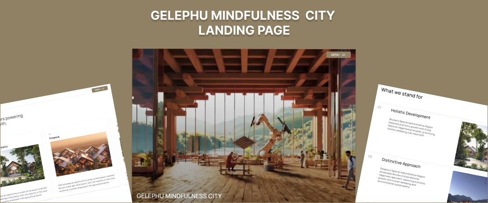

# GMC Landing Page

A modern recreation of the Gelephu Mindfulness City website built with React and GSAP animations.



## About This Project

This project is a reimagined version of the Gelephu Mindfulness City website landing page, created as a fun side project to explore and experiment with GSAP (GreenSock Animation Platform).

## Features

- React-based implementation of the Gelephu Mindfulness City landing page
- GSAP animations for smooth scrolling effects, transitions, and interactive elements
- Responsive design ensuring optimal viewing across all device sizes
- Tailwind CSS for styling with a utility-first approach

## Tech Stack

- React
- GSAP
- Tailwind CSS
- Vite

```bash
### Clone the repository
git clone https://github.com/yourusername/gelephu-mindfulness-landing.git

### Navigate to the project directory

cd gelephu-mindfulness-landing

### Install dependencies

npm install

### Start the development server

npm run dev
```
